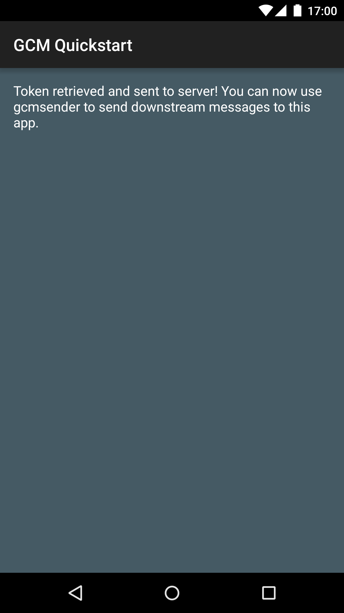

Google Cloud Messaging Quickstart
=================================

Google Cloud Messaging Android Quickstart app demonstrates registering
an Android app for GCM and handling the receipt of a GCM message.
InstanceID allows easy registration while GcmReceiver and
GcmListenerService provide simple means of receiving and handling
messages.

Introduction
------------

- This project is a sample found in GCM provided by Google.
- [Read more about Google Cloud Messaging](https://developers.google.com/cloud-messaging/)

Getting Started
---------------

- Import this project
- Create the google-services.json file by registering your app with Google Developer Console and paste it in the 'app' directory.
- If you are going to emulate a server for sending the Push, update the API_KEY in GcmSender.java, with API key from your project.
- Else, you can use PHPFiddle to send Push messages for testing.
- A notification containing the GCM message should be displayed on the
  device.

Screenshots
-----------

